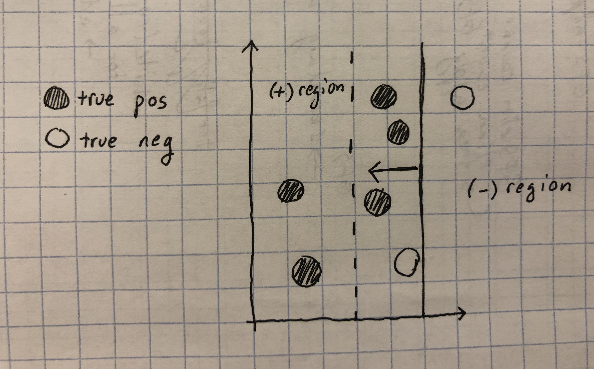

# Project Report: John Mays
## Survey
Multiple instance classification (MIC) is the subfield of machine learning that deals with the issue of classifying "bags."  Most typical learning problems have examples that are described by one tensor, with one label per example.  In the case of multiple instance problems however, bags are sets of example tensors (hereafter referred to as instances) with one label per bag.  There are three paradigms for solving MIC problems: instance space, bag space, and embedding space. [1]  Instance space algorithms unpack the instances and solve the task of classifying the instances, then classify the bags based on some rule or assumption about the instances in the bag (e.g. a positive bag has one or more positive instances in it).
I chose to implement two algorithms: Axis-Parallel Rectangles (APR) [2] and sparse-balanced SVM (sbMIL).  Axis-Parallel Rectangles is about creating a bounding hyperrectangle positive region and incrementally shifting the bounds to better classify the data points.  The paper that discusses APR, Dietterich et. al, describes nine different ways to select and APR, and I chose the classic version with greedy feature selection(GFS).  Details of implementations are found in **Methods**.

Lastly, a note about how my two papers compare to one another.  In my opinion, sbMIL is superior on paper.  Since it is a convex optimization problem at its come, it will always find the optimal solution.  On the other hand, axis parallel rectangles seems to get "stuck in local minima" a lot.  Although it is theoretically labeled as an optimization problem because there _is_ an objective function, APR isn't really a traditional optimization problem.  Nonetheless, the algorithm can often dig itself into a non-optimal hole by being greedy, and also perhaps because there is a limit on conjunctive constraints.  If this problem were capable of being 100% linearly separable on the set of instances, it would have to be able to have a number of constraints equal to the number of features times the number of examples -1.  There would have to be a test for every possible boundary.  On the other hand, axis-parallel rectangles limit the number of conjunctive constraints to 2 per feature---two opposite faces of the hyperrectangle.  Perhaps APR will always just be okay and sort of sloppy.  On the other hand, sbMIL is a clever way if applying SVMs to multiple instance data, and it stabs at the core of what makes multiple instance classification so difficult: not having truly labelend instances.  Through attempting to guess the labels of the instances, it is a much more mature instance-space algorithm than APR.  The sbMIL is also much better at handling sparse bags than the APR.  Their performance on non-sparse datasets is comparable according to Amores [1].

## Methods
### First Algorithm: Axis-Parallel Rectangles (APR)
This algorithm creates a hyperrectangle positive region by changing the bounds(faces of the hyperrectangle) to include or eliminate instances based on various heuristics.  

It starts off with the smallest hyperrectangle that contains every positively labeled instance, which just implies that the bounds are the max and min across every feature in the set of postively labeled instances.  This is called the "all-positive APR."

Then, it performs greedy feature selection by reverting the bounds to the entire instance space as positive, and then greedily re-adding individual boundary conditions from the all-positive APR until all of the negative instanes lie outside the positvie region

It classifies instances, then bags are classified using the SMI assumption (positive bag $\iff \geq$ 1 postive instance).
#### Pseudocode:
__Main algorithm:__
```
[1] import data;
[2] unpack instances out of bags;
[3] map nominal values to numeric representation;
[4] # create all positive APR:
[5] for every feature:
[6]   find max value belonging to a positive instance;
[7]   find min value belonging to a positive instance;
[8]   assign "less than max" and "greater than min" as bounds for positive region in this feature dimension
[9] call greedy feature selection
```
__Greedy feature selction:__
```
[1] save all-positive bounds to temporary variable
[2] set bounds to entire feature space (upper = inf, lower = -inf)
[3] while bounds are being re-added or false positives remain:
[4]   for all potential boundaries not re-added:
[5]     add it back
[6]     check classification with temporarily added bound
[7]   add the bound back that decreases false positives the most
```

### Second Algorithm: sbMIL (balanced SVM algorithm for sparse MIL)
#### Pseudocode:

This algorithm uses an SVM configured for sparse bags and a hyperparameter optimization procedure to guess which instances in positve bags are truly positive instances, then trains a single-instance SVM with that guess to become the instance classifier that feeds into the SMI assumption bag-level classifier.  The specifics would be redundant if explained right here, because they can be well-gathered from the pseudocode.

__Main algorithm:__
```
[1] import data;
[2] # do not unpack instances out of bags;
[3] η <- eta_estimation_function()
[4] w,b <- solve sMIL SVM (MIL especially for sparse bags)
[5] order all instances in truly positively labeled bags by wϕ(x)+b
[6] label the greatest η(# of instances in positive bags) as positive
[7] label the (1-η)(# of instances in positive bags) as negative
[8] # implicitly, every instance in a negative bag is also labeled as negative
[9] w,b <- solve SIL SVM (single-instance, regular old SVM algo) on entire input set of instances
```
Lines 4-7 are essentially all about attempting to determine how many positive instances there are in the dataset, taking a guess at labeling, and then submitting them to an instance learner.
__$\eta$ Estimation:__
```
[1] if labeled instances are available
[2]  η <- proportion of positive instances in small uniformly chosen subsection of training set
[3] else: # empirical optimization procedure
[4]  for a temporary η value in [0.1,0.2,...,1.0]
[5]    perform 9-fold cross validation (on what is currently the training set, so these could be "inner-folds")
[6]    compute average AUC(area under ROC curve) across all nine folds
[7]  η <- test η with the highest AUROC
```
#### The two underlying optimization problems:
- First, sMIL (sparse multiple instance learning is optimized):

minimize $f$ where $f(w,b,\chi) = \frac{1}{2}||w||^2+\frac{C}{\# (-) \text{instances}}\sum_{x\text{ is a negative isntance}}\chi_x + \frac{1}{2}||w||^2+\frac{C}{\# (+) \text{bags}}\sum_{X\text{ is a positive bag}}\chi_X$

subect to:

$w\phi (x) + b \leq -1 + \chi_x, \forall x \text{in negative bags}$

$\frac{w\phi (X)}{|X|} + b \leq \frac{2-|X|}{|X|} + \chi_X, \forall X \text{labeled positive}$

$\chi_x, \chi_X \geq 0$

- Later, regular SVM is called on the newly labeled data:

minimize $f$ where $f(w,b,\chi) = \frac{1}{2}||w||^2+\frac{C}{\text{\# instances total}}\sum_{\text{all instances}} \chi_x$

subect to:

$w\phi (x) + b \leq -1 + \chi_x, \forall x \text{in negative bags}$

$w\phi (x) + b \leq 1 0 \chi_x, \forall x \text{in positive bags}$


$\chi_x \geq 0$


## Research

### A Problem with Axis-Parallel Rectangles
The Axis-Parallel Rectangles algorithm is interesting, and I must say I have a personal liking towards it because it seems so neat and comprehensible.  However, it overfits on its training data a lot.  It does an amazing job fitting to the training data, usually having an accuracy(on the training data alone) of 1.00 or 0.99. This makes intuitive sense: In a very similar way to a linearly-separable SVM, it's boundaries can be singly determined by one data point, which makes it fairly prone to be overly fit to the data it is trained on.  I am interested in some kind of overfitting control to curb this issue.

The optimization problem in APR's greedy feature selection eliminates false positives without regard to false negatives being created.  


_if the boundary is moved to the dotted line, it correctly classifies a negative instance, but in the process, incorrectly classifies several positive instances_

This is the eproblem that the `elim_count` procedure decscribed in Dietterich et. al is supposed to address by taking into account the amount of positives misclassified (false negatives) by each boundary move.[2]  However, `elim_count` still gets rid of __all__ false positives before it is done, which can create a lot of false negatives in turn.  This explains why precision and recall are often so low upon testing.

### Potential Fix to Axis-Parallel Rectangles
What I would truly like is to refine APR's boundary estimation procedure so that it has some concept of the "value" of misclassification costs.  By this I mean, maybe getting rid of every single false-positive (like the APR algorithm currently does) learns too tight a bounds, and perhaps it could trade off or allow some false positives when it is moving the boundaries inwards.  When boundaries move inwards to eliminate positively classified negative instances, they can create a lot of negatively classified positive instances in the process (the negative region is growing).  So I would like to add some criterion that says "we are creating too many false negatives, therefore do not move this boundary."

So, my idea is to reconfigure the `elim_count` procedure from Dietterich et al. that will prevent the change of a boundary if the false negative misclassification cost is too great, greater than the cost of the false positives it could be eliminating.  One problem I still have at this point is that I don't actually know which is worse, or in what ratio, or how this may affect overfitting.  But, I could simply test different weight ratios and settle on one that satisfies a criterion for overfitting (does it do well on some kind of validation set).  I will model this after the eta estimation procedure described in my other paper, Bunescu and Mooney, 2007. [3]

The new parameter, $\lambda$, I will call the "equivalent exchange parameter and it works like this:"

The `elim_count` procedure (as well as my `balanced_elim_count`) explicitly removes one false postive at a time, and also calculates misclassification cost by finding how many false negatives that it just created.  If that misclassification cost is above a threshold $\lambda \in \mathbb{Z}^{+}$, `balanced_elim_count` will reject the offer to remove that boundary and leave it in place, effectivelt keeping some of the bounds fromt the all-positive APR if they are too costly.

__Balanced Elim Count:__
```
[1] calculate APR; # described earlier
[2] while (negative instances remain in positive region):
[3]   for every bound: # (2 per feature)
[4]     move the bound inwards to eliminate 1 negative instance;
[5]     count how many positive instances will also be eliminated;
[6]   choose the single elimination that requires the least positive instances to be eliminated;
[7]   if the least costly elimination is > lambda:
[8]     break;
```
__$\lambda$ Estimation:__

```
[1] else: # empirical optimization procedure
[2]  for a temporary λ value in [1,2,3,4,...10] # could do more
[3]    perform 5-fold cross validation (on what is currently the training set, so these could be "inner-folds")
[4]    compute average accuracy across all nine folds
[5]  λ <- test λ with the highest AUROC
```

## Results, Analysis, & Discussion

| Algorithm | Musk1 | Musk2 |
| --- | --- | --- |
| apr | 0.82 $\pm$ 0.090 | 0.75 $\pm$ 0.054 |
| apr_extension | 0.69 $\pm$ 0.080 | 0.74 $\pm$ 0.078 |
| sbMIL | 0.79 $\pm$ 0.021 | 0.74 $\pm$ 0.040 |

It does not seem like my extension improved upon APR at all. _on musk1..._ In fact, it decreased performance on musk1, but curiously, it did much better on musk2, than it did on musk1, and almost the same on musk2 than its non-extended counterpart.

sbMIL and APR has fairly similar performance on musk1, which contradicts my claim earlier that APR is a much less robust algorithm.  Although, sbMIL outperforms apr on musk2.

I do wonder if there is a sort of a theoretical upper bound to classification accuracy for MIC problems, because of the disconnect between bag and instance labels.  I suspect that if there was, it would be lower than on single-instance problems, especially when compared to instance-space algorithms.

Furthermore, there are a million ways to get an axis-parallel rectangle, it would be nice (if this algorithm is not long-forgotten) to do an extensive comparative study between all of the different extensions for APR.  But like I said in **Survey**, the inbuilt constraints of making the positve region a hyperrectangle seem as if they would choke this algorithm on complicated datasets.

## Bibliography

[1] J. Amores, "Multiple instance classification: Review, taxonomy, and comparitive study," _Artificial Intelligence,_ vol. 201, pp. 81-105, Aug. 2013, doi: 10.1016/j.artint.2013.06.003.

[2] T.G. Dietterich, R.H. Lathrop, and T. Lozano-Pérez, "Solving the multiple instance problem with axis-parallel rectangles," _Artificial Intelligcence,_ vol. 89, pp. 31-71, Jan. 1997, doi: 10.1016/S0004-3702(96)00034-3.

[3] R.C. Bunescu and R.J. Mooney, "Multiple Instance Learning for Sparse Positive Bags," appearing in _Proceedings of the 24th International Conference on Machine Learning,_ Corvalis, Oregon, United States, Jun. 20-24, 2007, doi: 10.1145/1273496.1273510.

